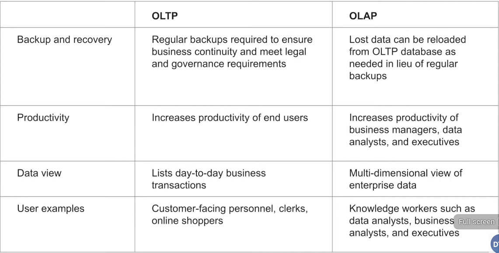
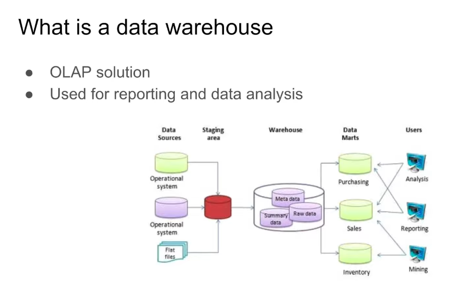
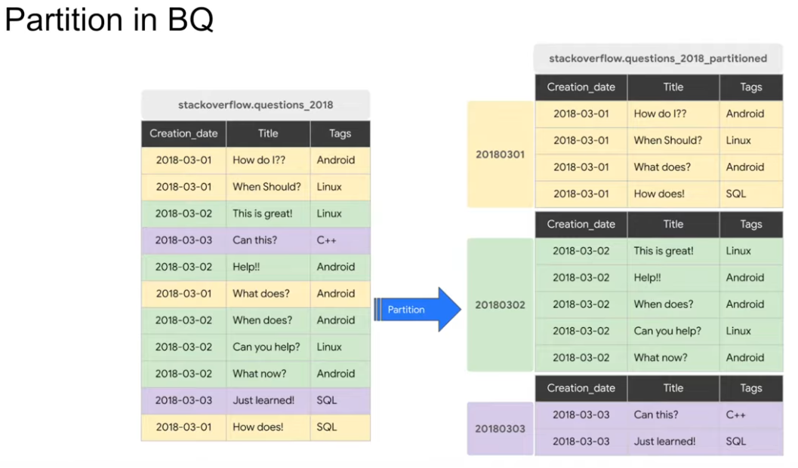

# Exercise 3 - Notes

## Overview

Here are some of my notes from the Data Warehouse Section.

## Learning Outcomes

- Understanding the Datawarehouse
- 
-

## OLAP vs OLTP

### Data warehouse


<!-- Explanation -->

## Setup

### Steps

For the following exercise I created a new uv enviroment
```bash
# uv init
```
Next due to the script's dependencies I installed the google cloud storage package 
```bash
# uv add google-cloud-storage
```
Next step is to run the script (we also need the json key from the service account idealy to name it as gcs.json)
```bash
# uv run python load_yellow_taxi_data.py
```
<!-- Configuration details -->
Now we can verify the completed .parquet files in the cloud storage.


## Big Query set up
Our next move is to create an external table from our cloud storage .parquet files (make sure that are in the same region).
```SQL
    
CREATE OR REPLACE EXTERNAL TABLE `greentaxidez.dezoomcamp_hw3_2026_consta.external_nytaxi`
OPTIONS (
  format = 'PARQUET',
  uris = ['gs://dezoomcamp_hw3_2026_consta/yellow_tripdata_2024-*.parquet'])

```

Now that we have the files in our cloud storage in a bucket.Our next move is to import to BigQuery.

Now our next move is to make the a paritioned tables using the datetime column in our dataset.

### What is paritioning ( in one picture ) ?



### Reasons to parition a table.

+ Partitioning improves loading performance by breaking large datasets into smaller, manageable segments that can be processed independently.

+ Partitioning also enhances performance through maintenance efficiency. 

for our demostration we will create a non paritioned tables and a paritioned one to compare the differences.

## Query for the non partinioned
```SQL
CREATE OR REPLACE TABLE taxi-rides-ny.nytaxi.yellow_tripdata_non_partitioned AS
SELECT * FROM taxi-rides-ny.nytaxi.external_yellow_tripdata;
```


## Query for the partinioned one
```SQL
CREATE OR REPLACE TABLE taxi-rides-ny.nytaxi.yellow_tripdata_partitioned
PARTITION BY
  DATE(tpep_pickup_datetime) AS
SELECT * FROM taxi-rides-ny.nytaxi.external_yellow_tripdata;
```

## Questions & Answers

### Q1:

**Answer:**

### Q2:

**Answer:**

## Resources

- [Link description](url)

## Notes

<!-- Additional notes and observations -->
