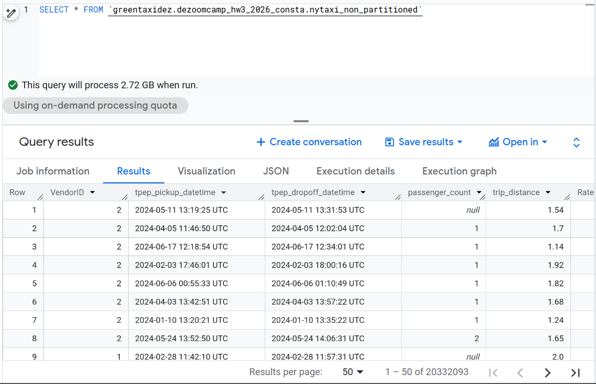
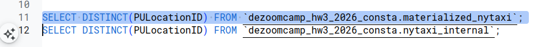
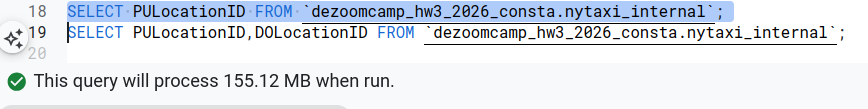

## These are my findings and solutions for Data engineering bootcamp exercise 3

### Question 1
What is count of records for the 2024 Yellow Taxi Data?



so the answer is : 20,332,093

### Question 2

What is the estimated amount of data that will be read when this query is executed on the External Table and the Table?

For External Tables, BigQuery often shows 0 MB estimated bytes processed because it cannot accurately estimate how much data will be scanned in external storage

For the Materialized (native) Table, BigQuery can accurately estimate the scan size, and a COUNT(DISTINCT ...) requires scanning the entire column, resulting in 155.12 MB read.

0 MB for the External Table and 155.12 MB for the Materialized Table



### Question 3


ANS:
BigQuery is a columnar database, and it only scans the specific columns requested in the query. Querying two columns (PULocationID, DOLocationID) requires reading more data than querying one column (PULocationID), leading to a higher estimated number of bytes processed.



### Question 4


``` SQL
select count (*) from `dezoomcamp_hw3_2026_consta.nytaxi_internal` where fare_amount = 0.0
```


### Question 5

What is the best strategy to make an optimized table in Big Query if your query will always filter based on tpep_dropoff_datetime and order the results by VendorID (Create a new table with this strategy)

Ans : Partition by tpep_dropoff_datetime and Cluster on VendorID
Why: if we do partitioning by tpep_dropoff_datetime the queries always filter on the date, which reduces the amount of data scanned. Clustering by VendorID helps organize the data within each partition, improving performance when results.

### Question 6

Write a query to retrieve the distinct VendorIDs between tpep_dropoff_datetime 2024-03-01 and 2024-03-15 (inclusive)

Use the materialized table you created earlier in your from clause and note the estimated bytes. Now change the table in the from clause to the partitioned table you created for question 5 and note the estimated bytes processed. What are these values?

Ans:
310.24 MB for non-partitioned table and 26.84 MB for the partitioned table


### Question 7. External table storage

Where is the data stored in the External Table you created?

Ans: GCP Bucket

Why: BQ can check the schema and make an external table through the bucket but it doesn't store it inside the bucket.

### Question 8.
It is best practice in Big Query to always cluster your data: True False 

Ans:False

Why: to partition yes but to cluster ... sometimes it doesnt matter ... it depends the nature of the data.