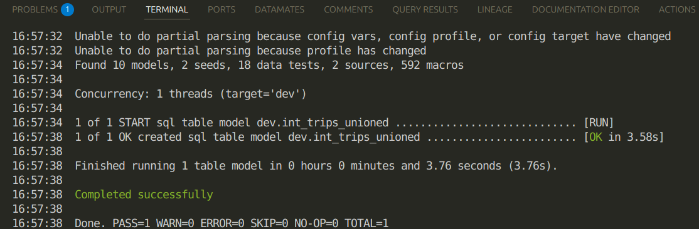
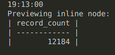
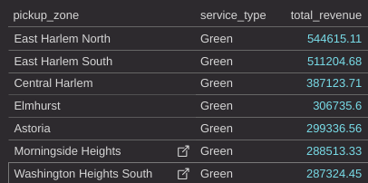
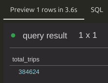
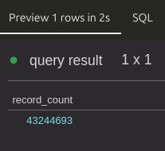

## These are my findings and solutions for Data engineering bootcamp exercise 3

### Question 1. dbt Lineage and Execution
If you run dbt run --select int_trips_unioned, what models will be built?

Well if you run this command it will build the int_trips_unioned only : 




### Question 2. dbt Tests

Your model fct_trips has been running successfully for months. A new value 6 now appears in the source data.

What happens when you run dbt test --select fct_trips?

Ans: dbt will fail the test, returning a non-zero exit code

### Question 3. Counting Records in fct_monthly_zone_revenue

After running your dbt project, query the fct_monthly_zone_revenue model.

What is the count of records in the fct_monthly_zone_revenue model?

Ans: 12,184

Due to 16 GB or RAM and the CTE's where taking too much RAM to process using Claude code we used a new model 

    count_fct_monthly_zone_revenue.sql

```dbt

select count(*) as record_count from (
    select
        coalesce(z.zone, 'Unknown Zone') as pickup_zone,
        cast(date_trunc(t.pickup_datetime, month) as date)
        date_trunc('month', t.pickup_datetime)
         as revenue_month,
        t.service_type
    from {{ ref('int_trips_unioned') }} t
    left join {{ ref('dim_zones') }} z
        on t.pickup_location_id = z.location_id
    group by 1, 2, 3
)
```
```bash
dbt run --target prod --select int_trips_unioned dim_zones count_fct_monthly_zone_revenue && dbt show --target prod --inline "select * from {{ ref('count_fct_monthly_zone_revenue') }}"
```



### Question 4. Best Performing Zone for Green Taxis

Ans: East Harlem North

```SQL
select
    pickup_zone,
    service_type,
    sum(revenue_monthly_total_amount) as total_revenue
from {{ ref('fct_monthly_zone_revenue') }}
where service_type = 'Green'
    and revenue_month >= '2019-01-01'
    and revenue_month < '2021-01-01'
group by pickup_zone, service_type
order by total_revenue desc
```



### Question 5. Green Taxi Trip Counts (October 2019)

Using the fct_monthly_zone_revenue table, what is the total number of trips (total_monthly_trips) for Green taxis in October 2019?

Ans: 384624

```SQL
select SUM(total_monthly_trips) as total_trips
from {{ ref('fct_monthly_zone_revenue') }}
Where service_type = 'Green' and revenue_month >= '2019-10-01'
    and revenue_month < '2019-11-01'
group by service_type 
```



### Question 6. Build a Staging Model for FHV Data

What is the count of records in stg_fhv_tripdata?

    stg_fhv_tripdata.sql
```SQL
with source as (
    select * from main.fhv_tripdata
),

renamed as (
    select
        cast(dispatching_base_num as string) as dispatching_base_num,
        cast(pickup_datetime as timestamp) as pickup_datetime,
        cast("dropOff_datetime" as timestamp) as dropoff_datetime,
        cast("PUlocationID" as integer) as pickup_location_id,
        cast("DOlocationID" as integer) as dropoff_location_id,
        cast("SR_Flag" as integer) as sr_flag,
        cast("Affiliated_base_number" as string) as affiliated_base_number
    from source
    where dispatching_base_num is not null
)

select * from renamed


where pickup_datetime >= '2019-01-01' and pickup_datetime < '2020-01-01'

```


    ingestion_fhv.py
``` python
import duckdb
import requests
from pathlib import Path

BASE_URL = "https://github.com/DataTalksClub/nyc-tlc-data/releases/download/fhv"
DATA_DIR = Path("data") / "fhv"

def download_and_convert_files():
    DATA_DIR.mkdir(exist_ok=True, parents=True)

    for year in [2019, 2020, 2021]:
        for month in range(1, 13):
            parquet_filename = f"fhv_tripdata_{year}-{month:02d}.parquet"
            parquet_filepath = DATA_DIR / parquet_filename

            if parquet_filepath.exists():
                print(f"Skipping {parquet_filename} (already exists)")
                continue

            csv_gz_filename = f"fhv_tripdata_{year}-{month:02d}.csv.gz"
            csv_gz_filepath = DATA_DIR / csv_gz_filename

            try:
                response = requests.get(f"{BASE_URL}/{csv_gz_filename}", stream=True)
                if not response.ok:
                    print(f"Skipping {csv_gz_filename} (HTTP {response.status_code})")
                    continue

                with open(csv_gz_filepath, 'wb') as f:
                    for chunk in response.iter_content(chunk_size=8192):
                        f.write(chunk)

                print(f"Converting {csv_gz_filename} to Parquet...")
                con = duckdb.connect()
                con.execute(f"""
                    COPY (SELECT * FROM read_csv_auto('{csv_gz_filepath}', ignore_errors=true, strict_mode=false))
                    TO '{parquet_filepath}' (FORMAT PARQUET)
                """)
                con.close()
                print(f"Completed {parquet_filename}")
            except Exception as e:
                print(f"Failed {csv_gz_filename}: {e}")
                if parquet_filepath.exists():
                    parquet_filepath.unlink()
            finally:
                if csv_gz_filepath.exists():
                    csv_gz_filepath.unlink()

def load_into_duckdb():
    con = duckdb.connect("dev.duckdb")
    con.execute("CREATE SCHEMA IF NOT EXISTS main")
    con.execute("""
        CREATE OR REPLACE TABLE main.fhv_tripdata AS
        SELECT * FROM read_parquet('data/fhv/*.parquet', union_by_name=true)
    """)
    print("Loaded FHV data into main.fhv_tripdata")
    con.close()

if __name__ == "__main__":
    download_and_convert_files()
    load_into_duckdb()
```

    count_of_fhv_data.sql

```SQL
select count(*) as record_count from {{ ref('stg_fhv_tripdata') }}
```
Ans: 43,244,693

