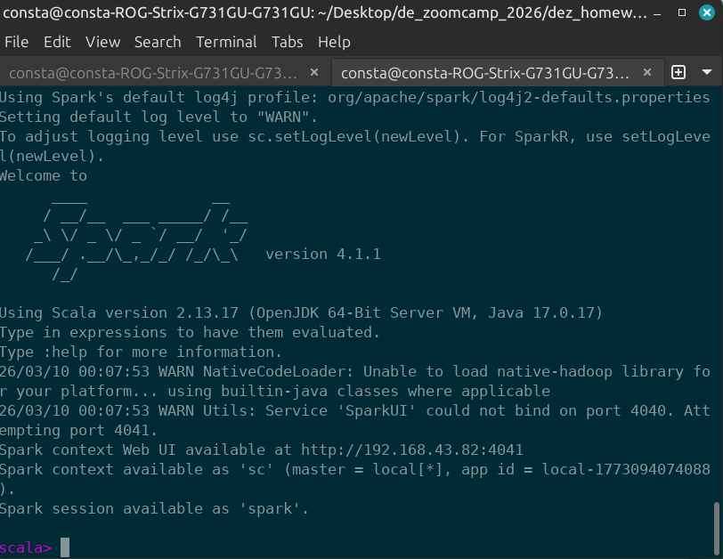
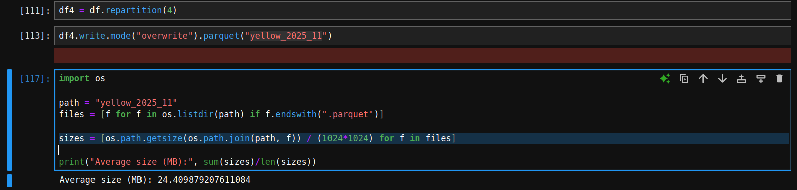

# Module 6 Homework

In this homework we'll put what we learned about Spark in practice.

For this homework we will be using the Yellow 2025-11 data from the official website:

```bash
wget https://d37ci6vzurychx.cloudfront.net/trip-data/yellow_tripdata_2025-11.parquet
```


## Question 1: Install Spark and PySpark

- Install Spark
- Run PySpark
- Create a local spark session
- Execute spark.version.

What's the output?

The output is : 
## Question 2: Yellow November 2025

Read the November 2025 Yellow into a Spark Dataframe.

Repartition the Dataframe to 4 partitions and save it to parquet.

What is the average size of the Parquet (ending with .parquet extension) Files that were created (in MB)? Select the answer which most closely matches.

- 6MB
- 25MB
- 75MB
- 100MB



## Question 3: Count records

How many taxi trips were there on the 15th of November?

Consider only trips that started on the 15th of November.

- 62,610
- 102,340
- 162,604
- 225,768

Ans: 
```bash 
spark.sql("""
SELECT COUNT(*) FROM yellow_taxi_2025 WHERE DATE(tpep_pickup_datetime) = '2025-11-15';
""").show() 
```
```bash
+--------+
|count(1)|
+--------+
|  162604|
+--------+
```


## Question 4: Longest trip

What is the length of the longest trip in the dataset in hours?

- 22.7
- 58.2
- 90.6
- 134.5

Ans : 
```bash
spark.sql("""
SELECT MAX(
    (unix_timestamp(tpep_dropoff_datetime) - unix_timestamp(tpep_pickup_datetime)) / 3600
) AS max_trip_hours
FROM yellow_taxi_2025
""").show()
```

```bash
+-----------------+
|   max_trip_hours|
+-----------------+
|90.64666666666666|
+-----------------+
```
## Question 5: User Interface

Spark's User Interface which shows the application's dashboard runs on which local port?

- 80
- 443
- 4040
- 8080

Ans: http://localhost:4040/jobs/


## Question 6: Least frequent pickup location zone

Using the zone lookup data and the Yellow November 2025 data, what is the name of the LEAST frequent pickup location Zone?

- Governor's Island/Ellis Island/Liberty Island
- Arden Heights
- Rikers Island
- Jamaica Bay

Ans:

```bash
df.join(zones, df.PULocationID == zones.LocationID) \
  .groupBy("Zone") \
  .count() \
  .orderBy("count") \
  .show(5)
```
```sql
+--------------------+-----+
|                Zone|count|
+--------------------+-----+
|Governor's Island...|    1|
|Eltingville/Annad...|    1|
|       Arden Heights|    1|
|       Port Richmond|    3|
|       Rikers Island|    4|
+--------------------+-----+
only showing top 5 rows
```