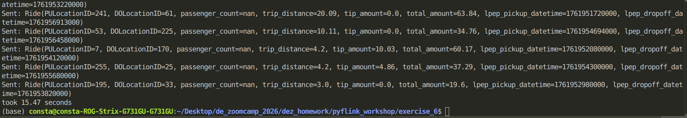
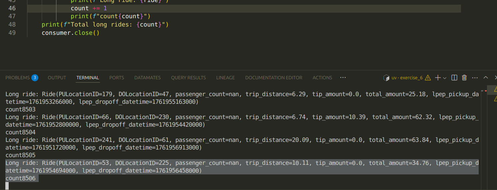

# Module 7 Homework — PyFlink (Questions 4–6)

## Question 1. Redpanda version

Ans: rpk version: v25.3.9


## Question 2. Sending data to Redpanda
Create a topic called green-trips:
Now write a producer to send the green taxi data to this topic.

Convert each row to a dictionary and send it to the green-trips topic. You'll need to handle the datetime columns - convert them to strings before serializing to JSON.

Measure the time it takes to send the entire dataset and flush:
```bash
from time import time

t0 = time()

# send all rows ...

producer.flush()

t1 = time()
print(f'took {(t1 - t0):.2f} seconds')
```
Ans: took 15.47 seconds




## Question 3. Consumer - trip distance

Write a Kafka consumer that reads all messages from the green-trips topic (set auto_offset_reset='earliest').

Count how many trips have a trip_distance greater than 5.0 kilometers.

How many trips have trip_distance > 5?

    6506
    7506
    8506
    9506


